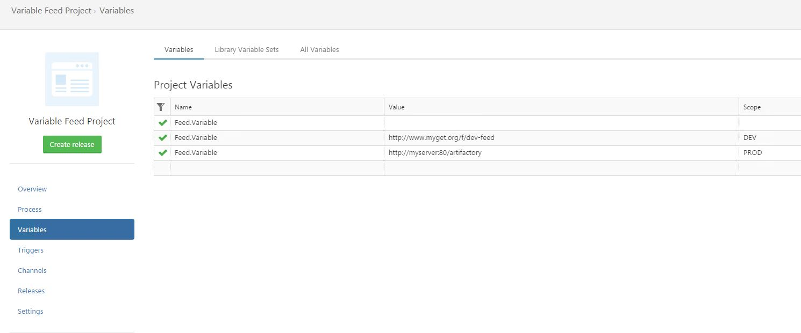

When defining a package feed in Octopus, you have the option to use a variable by selecting the Custom binding option. This is often useful when the package feed needs to change based on scoping. There is something to keep in mind though when using a variable to define the package feed. At the time of release creation there is only a small amount of variable evaluation we do. And unfortunately we do not have any environmental context at this stage of the deployment. So Octopus requires a placeholder that points to the variable you will be using.

As Octopus checks the feed and package at release creation time, even if it is not used later on, we require an unscoped variable with the feed value to be present for us to evaluate.

To fix this, you will need to do the following:

Create a new variable with the name as your feed variable and have it with out a value or scope. You should end up with at least 2 variables with the same name, one empty and the other with NuGet feed value and any scoping.

Below are some screenshots that illustrate an example of this. In my example, I have a package feed that points to three different folders depending on their environment. I can call a single #{Feed.Variable} in my package step and have Octopus select the value based on the environment I am deploying to. 

In my second screenshot, you can see the dummy variable I have created which is unscoped. This allows Octopus to use the #{Feed.Name} Variable at the time the release is created and apply the correct value when you deploy.

Once the dummy varialbe is set, the variable feed should work as expected.
