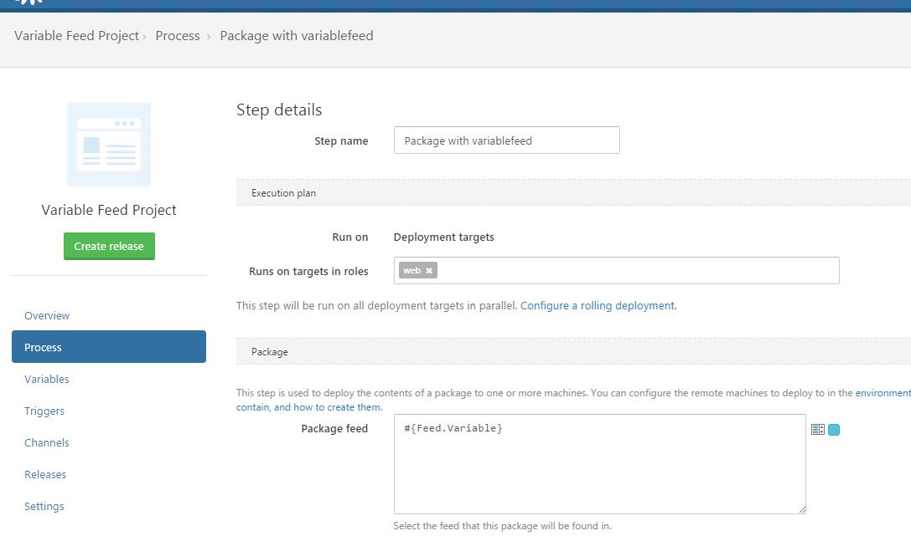
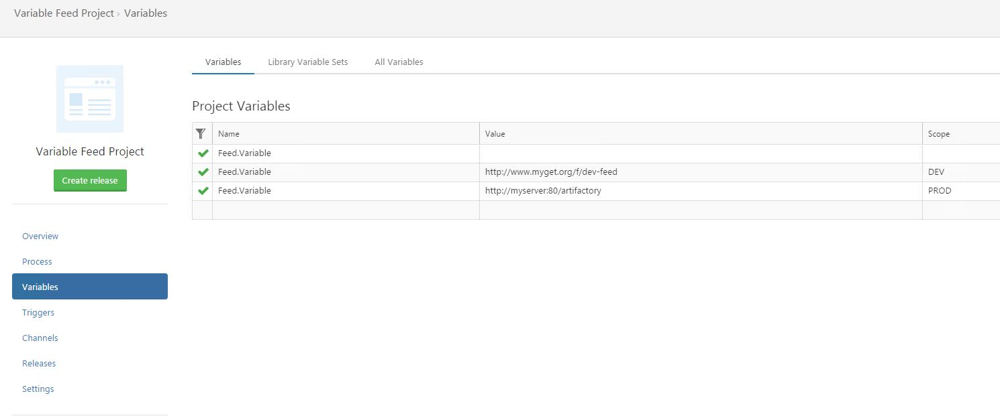

In Octopus, you are able to define a package feed with a variable, this is useful for when the package feed may need to change based on different scoping.

:::warning
As Octopus checks the feed and package at release creation time there is only a small amount of variable evaluation done. Unfortunately, we do not have any environmental context at this stage of the deployment. So even if it is not used later on, Octopus require an unscoped variable with the feed value to be present for the variable evaluation.
:::

To fix this, you will need to do the following:

Create a new variable with the name as your feed variable and have it with out a value or scope. You should end up with at least 2 variables with the same name, one empty and the other with NuGet feed value and any scoping.

Below are some screenshots that illustrate an example of this. In my example, I have a package feed that points to three different folders depending on their environment. I can call a single #{Feed.Variable} in my package step and have Octopus select the value based on the environment I am deploying to. 

In my second screenshot, you can see the placeholder variable I have created which is unscoped. This allows Octopus to use the #{Feed.Name} Variable at the time the release is created and apply the correct value when you deploy.

Once the placeholder variable is set, the variable feed should work as expected.
